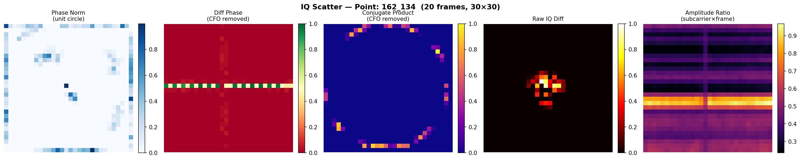
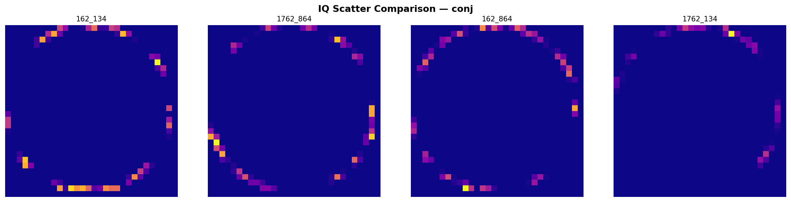

# q2
Feature ที่ใช้งาน
1.Amplitude Ratio (ratio)
   feature = |H_RX1| / |H_RX2|
           = sqrt(I1²+Q1²) / sqrt(I2²+Q2²)
2.IQ Scatter (iq)
   feature = 2D density map 30×30
             normalize I/Q เป็น unit circle
             plot phase angle ของ H1-H2
           

  
  

